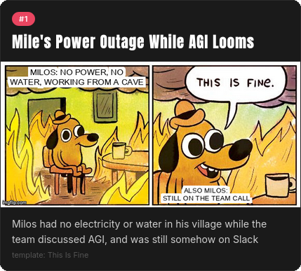
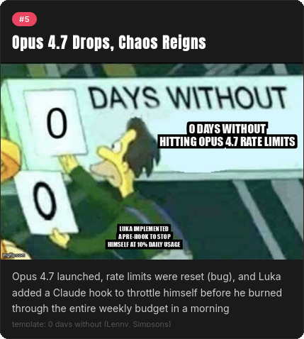

# I Was On Vacation — What Happened Here?!

> Give Claude Code a Slack channel and a number of days. Get back a meme recap page of everything you missed.

---

## What it does

1. Reads message history from a Slack channel (threads included)
2. Groups messages into 5–10 major events / themes
3. Picks the perfect imgflip meme template for each event
4. Captions it with something specific and funny
5. Renders `output/index.html` — a shareable meme recap page

---

## Prerequisites

- **Python 3.8+** — `python3 --version`
- **imgflip account** — free at https://imgflip.com/signup (100 memes/day on the free tier)
- **Claude Code** — https://claude.ai/code
- **Slack MCP** — the bot needs access to your target channel (see setup below)

---

## Setup

**1. Copy the env file and fill it in:**

```bash
cp .env.example .env
# then edit .env with your actual credentials
```

You need:
- `IMGFLIP_USERNAME` / `IMGFLIP_PASSWORD` — your imgflip login
- `SLACK_MCP_XOXP_TOKEN` — a Slack user token (starts with `xoxp-`)
- `SLACK_DEFAULT_CHANNEL` — the channel ID to use when none is passed as an argument (no fallback to all channels — if unset and no channel is given, Claude will stop and ask you before fetching anything)

To get a Slack user token: go to [api.slack.com/apps](https://api.slack.com/apps), create an app, add these User Token Scopes under *OAuth & Permissions*, then install it to your workspace:

```
channels:history  channels:read  groups:history  groups:read
im:history  mpim:history  users:read
```

**2. Source the env file before running Claude Code:**

```bash
source .env   # or use direnv / .envrc
claude
```

---

## Usage

### The easy way — slash command

Inside Claude Code, run:

```
/mememeup
```

Claude will ask which channel and how many days, then handle everything automatically.

You can also pass arguments directly:

```
/mememeup 14
/mememeup #engineering
/mememeup 7 #general
```

### The manual way

Just describe what you want in plain English:

> "I was on vacation for two weeks. Recap #engineering as memes."

Claude follows the steps in `CLAUDE.md` automatically.

---

## meme_maker.py — utility commands

The script is used by Claude under the hood, but you can also call it directly:

Both invocation styles work identically:

```bash
python3 meme_maker.py <subcommand>
uv run  meme_maker.py <subcommand>
```

```bash
# list available meme templates
python3 meme_maker.py templates
python3 meme_maker.py templates --limit 100

# create a single captioned meme
python3 meme_maker.py create \
  --id     181913649 \
  --top    "The deploy will take 5 minutes" \
  --bottom "3 hours later" \
  --event  "The Deploy Incident" \
  --summary "Nobody was surprised" \
  --template-name "Drake Hotline Bling"

# render output/index.html from all saved memes
python3 meme_maker.py html

# start over
python3 meme_maker.py clear
```

Output lands in `output/index.html`. Open it in any browser.

---

## Output

`output/` is gitignored — your team's Slack content stays local.

---

## Examples





